# 📚 Projekt-Erklärung – Skala Micro-Service-Stack

> Version: Mai 2025  
> Komponenten: **PostgreSQL 16 · Auth-Service · User-Service · Docker Compose**

---

# 🦈 STARTUP

## environment preparation
1. **UNIX** docker shared net and create .env (when not existing or running)
    ```
    chmod +x setup.sh && ./setup.sh
    
   ```
   **WINDOWS** start
   powershell
    ```
    Set-ExecutionPolicy -Scope Process -ExecutionPolicy Bypass
    ./setup.ps1
    ```
## Startup docker compose
1. docker compose startup
    ```
    docker compose build && docker compose up -d
    ```
2. docker compose shutdown and delete db
    ```
    docker compose down -v 
   ```

## 1  Architekturübersicht

```mermaid
flowchart TD
    subgraph s1["Docker-Compose-shared-network"]
        DB_auth[("PostgreSQL 16<br>db_auth Volume")]
        DB_user[("PostgreSQL 16<br>db_user Volume")]
        USER("User-Service<br>PORT 4000:4000")
        AUTH("AUTH-Service<br>PORT 5050:5000")
    end
    Browser/Frontend["Frontend"] -- JWT Register, Login &amp; Refresh --> AUTH
    
    Browser/Frontend -- CRUD mit Bearer JWT --> USER
    AUTH <--> DB_auth
    USER <--> DB_user
    AUTH -- msg token gültig --> USER
    USER -- "auth-service/auth/verify" --> AUTH
    USER -- userinfo --> Browser/Frontend
    AUTH -- JWT token --> Browser/Frontend
```



- PostgreSQL zwei db

  - db_user – Stammdaten der User

  - db_auth – Passwort-Hash + Refresh-Token

- Auth-Service verantwortet Registrierung, Login, Token-Refresh & -Logout.

- User-Service bietet geschützte CRUD-Operationen auf den Nutzern.

- JWT vom Auth verifiziert wieder zum User-Service

- Docker Compose startet alles inklusive Volume für persistente Daten und shared-network


## Datenbankschema

| Tabelle   | Spalten                                                                                       | Zweck                         |
|-----------|-----------------------------------------------------------------------------------------------| ----------------------------- |
| `db_user` | `id UUID PK`, `name TEXT`, `email TEXT UNIQUE`, `role TEXT` ,`created_at TIMESTAMPTZ`         | Öffentliche Profildaten       |
| `db_auth` | `user_id UUID PK`, `name`, `email`, `password_hash`, `refresh_token`, `refresh_token_expires` | Anmeldedaten & Token-Rotation |

Beide Tabellen liegen in derselben Datenbank users.
Migrationen sind reine SQL-Dateien und werden manuell (oder via CI-Job) eingespielt.
### Migration prüfen
  docker compose exec db psql -U postgres -d users -c '\dt'


## UserService

| Methode  | Pfad         | Middleware       | Beschreibung       |
| -------- | ------------ | ---------------- | ------------------ |
| `POST`   | `/users`     | `authMiddleware` | Neuen User anlegen |
| `PATCH`  | `/users/:id` | `authMiddleware` | Teil-Update        |
| `DELETE` | `/users/:id` | `authMiddleware` | Löschen            |
| `GET`    | `/health`    | —                | Lebenszeichen      |


### Besonderheiten

- authMiddleware verifiziert JWT (jsonwebtoken) und hängt req.user.sub an.

- Controller-Error-Handling fängt 23505 (E-Mail-Doublette) → HTTP 409 ab.

- Model-Layer verwendet parametrisiertes SQL, verhindert SQL-Injection.


# 📋 TODOs


- Tests – Jest + Supertest: End-to-End-Flows automatisieren.

- Swagger – swagger-ui-express in beiden Services, gemeinsame JWT-Auth-Header-Schemes.

- error handling


# 🚀 Quick Start – USER Micro-Service Stack

Dieses README enthält **alle Schritte**, um den kompletten Stack  
(PostgreSQL 16 + Auth-Service + User-Service) von Null bis zum ersten API-Call zu starten.

---

## 0  Voraussetzungen

| Tool | Befehl zum Prüfen | Erwartung |
|------|------------------|-----------|
| Docker Engine | `docker --version` | ≥ 24.x |
| Docker Compose V2 | `docker compose version` | v2.x |
| (optional) jq für JSON-Parsing | `brew install jq` | |

---

## 1  Repo init
    cp services/user-service/.env.example  services/user-service/.env
    cp services/auth-service/.env.example  services/auth-service/.env
    # → ggf. PORTS, DB_PASS, JWT_SECRET anpassen

    npm install

    cd services/auth-service 
    npm install

    cd services/user-service 
    npm install
    

    docker compose build        # Images bauen (einmalig oder nach Änderungen)
    docker compose up -d        # db, user-service, auth-service im Hintergrund
    docker compose ps           # STATUS muss „running“ sein


## Auth-Flow & CRUD testen
### Registrieren & Tokens holen
    LOGIN=$(curl -s -X POST http://localhost:5050/auth/register \
    -H 'Content-Type: application/json' \
    -d '{"name":"Ada","email":"ada@example.com","password":"geheim123"}')

    ACCESS=$(jq -r .accessToken  <<<"$LOGIN")
    REFRESH=$(jq -r .refreshToken <<<"$LOGIN")

### User anlegen
    NEW=$(curl -s -X POST http://localhost:4000/users \
    -H "Authorization: Bearer $ACCESS" \
    -H 'Content-Type: application/json' \
    -d '{"name":"Grace Hopper","email":"grace@hopper.dev"}')

    ID=$(jq -r .id <<<"$NEW")

### User updaten
    curl -X PATCH http://localhost:4000/users/$ID \
    -H "Authorization: Bearer $ACCESS" \
    -H 'Content-Type: application/json' \
    -d '{"name":"Grace B. Hopper"}'

## Forgot password
    POST http://localhost:5050/auth/forgot-password 

### neuen Login durchführen
    LOGIN=$(curl -s -X POST http://localhost:5050/auth/login \
    -H 'Content-Type: application/json' \
    -d '{"email":"ada@example.com","password":"geheim123"}')
    REFRESH=$(jq -r .refreshToken <<<"$LOGIN")

### Refresh aufrufen
    curl -X POST http://localhost:5050/auth/refresh \
    -H 'Content-Type: application/json' \
    -d '{"refreshToken":"'"$REFRESH"'"}'

### User löschen
    curl -X DELETE http://localhost:4000/users/$ID \
    -H "Authorization: Bearer $ACCESS"

## Logs und Wartung
| Aktion                          | Befehl                                |
| ------------------------------- | ------------------------------------- |
| Live-Logs aller Container       | `docker compose logs -f`              |
| Einzelner Dienst                | `docker compose logs -f user-service` |
| Stack stoppen                   | `docker compose down`                 |
| Stack + Volumes löschen (Reset) | `docker compose down -v`              |


## DB RESET

    docker compose down -v          # Container stoppen + Volume löschen
    docker compose up -d            # neues Volume; DB leer

build and start
    docker compose build && docker compose up -d


## logs
     docker compose logs -f auth-service
    docker compose logs -f user-service           


## tabelle debug

    docker compose exec db psql -U postgres -d users -c '\dt'


# Fouad start
powershell

    Set-ExecutionPolicy -Scope Process -ExecutionPolicy Bypass
    ./setup.ps1